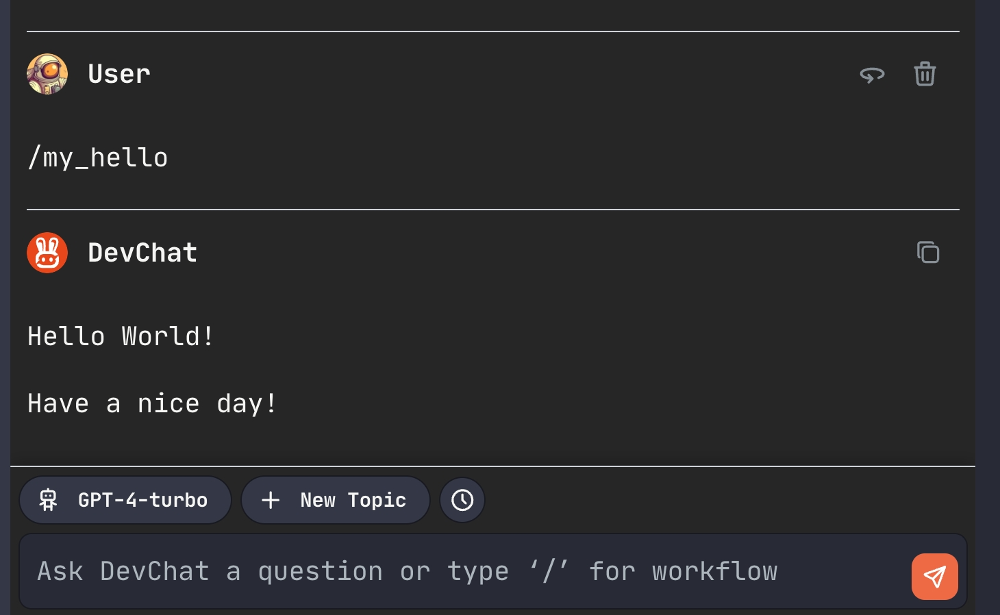

# DevChat 自定义工作流快速入门

通过创建一个简单的 Hello 工作流了解 DevChat Workflow 的基本概念。

## 基本要求

在开始之前，需要安装DevChat插件:
- VSCode
- JetBrains IDE

## 创建自定义工作流

安装DevChat插件后，你的用户目录下会有`.chat/scripts`目录，这个目录用于DevChat Workflows相关管理，其中`custom`目录用于存放自定义工作流。

### 1. 创建并注册自定义命名空间`demo`

- 在`.chat/scripts/custom`目录下创建一个名为`demo`的目录。
- 在`.chat/scripts/custom`目录下创建`config.yml`文件，其内容如下：
```yaml
namespaces: 
  - demo
```

了解更多：[命名空间](./namespace.md)


### 2. 在`demo`中创建`my_hello`的工作流

- 在`demo`目录下创建`my_hello`目录。
- 在`my_hello`目录下创建`command.yml`文件，其内容如下：
```yaml
description: Say hello to the world
steps:
  - run: echo "Hello World!"
  - run: echo "Have a nice day!"
```

了解更多：[工作流定义文件规范](./command_spec.md)

### 3. 运行`my_hello`工作流

打开DevChat聊天栏，输入`/my_hello`并发送。




## 总结

- 自定义工作流统一存放在`~/.chat/scripts/custom`目录下，通过命名空间进行管理，每个命名空间下可以有多个工作流。
- 每个工作流由一个包含`command.yml`的目录组成，目录名即为工作流名。`command.yml`为工作流的定义文件。
- 通过在 DevChat 聊天栏中发送以`/<workflow_name> `开头的消息触发工作流。
